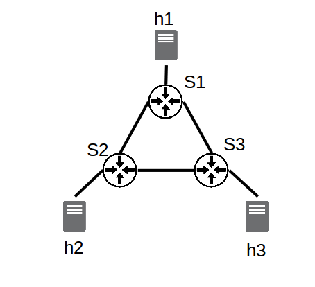

<center> <h1>A la découverte de SDN</h1> </center>

Ce TP doit vous permettre de comprendre un peu mieux le fonctionnement de SDN, ainsi que son intérêt et ses possibles applications au travers de :
* la prise en main d'un émulateur de réseaux virtuels (Mininet);
* l'analyse du fonctionnement du protocole Openflow;
* la prise en main d'un contrôleur SDN : Ryu (il ne s'agit bien sûr que d'un seul contrôleur et bien d'autres sont présents sur le marché : ONOS, OpenDayLight, etc.);
  - développement de nouvelles applications
  - découverte de l'API REST de Ryu

*Note :* Pour l'ensemble de ce TP, il vous sera demandé de travailler depuis la racine du projet *MOR_TP*.

## 1. Mininet ##

Mininet, basé sur de la virtualisation d'OS, est un émulateur permettant de créer et d'interagir en local un réseau virtuel.

### 1.1 Prise en main ###

*Note :* Si vous venez de réaliser l'installation, le service openvswitch que nous allons utiliser n'est sûrement pas lancé, et pour l'ensemble de ce TP son fonctionnement sera nécessaire. Lancez donc la commande : `service openvswitch-switch status` pour vérifier si le service est en fonctionnement et si nécessaire, lancez le.

Pour commencer, lancez mininet avec la topologie par défaut, pour ceci, utilisez la commande suivante en mode root :

`sudo mn`

*Note* : La commande que nous utiliserons par la suite prendra d'autres paramètres :
`sudo mn --switch=ovsk,protocols=OpenFlow13`

Nous verrons dans les parties suivantes à quoi servent les indications correspond au type de switch et au type de protocole.

Une fois que vous avec tapé cette commande, vous vous retrouvez à l'intérieur du shell mininet. Différentes commandes peuvent y être utiles :

```console
mininet> exit   #permet de quitter mininet

mininet> help   # permet d'afficher les commandes qui peuvent être utilisées avec cet émulateur

mininet> h1 ping h2 # montre comment faire un ping depuis h1 vers h2
```

**1.1.1.** De quoi est composée la topologie par défaut de mininet (combien de switch openflow et combien d'hôtes) ?

**1.1.2.** À quoi servent les commandes pingall, iperf, xterm, ifconfig, dump, links et net de mininet ?

**1.1.3.** Les switchs de votre instance mininet son configurés en "learning switch" par défaut.
  * Qu'est de qu'un "learning switch" ? Quel est le résultat de pingall lorsque le learning switch est utilisé ?
  * Quittez mininet et rédémarrer en désactivant le contrôleur (`--controller none`). Quel est le résultat du pingall ? Quel semble donc être le rôle du contrôleur dans une architecture SDN ?

*Note :* Dans cette partie comme dans la suite de ce TP certaines commandes pourront s'avérer utilises, notamment `mn -c` qui pourra vous permettre en cas de problèmes de faire un clean de mininet.

### 1.2 Définition de topologies customisées ###

Mininet permet nativement de définir de façon simple un grand nombre de topologies au travers de l'utilisation de différentes arguments.
Jusqu'à présent la topologie que nous avons utilisée est composée de deux hôtes (h1,h2) et d'un switch (s1).

La commande que nous avons utilisée jusqu'ici correspond donc à une topologie d'arbre avec une profondeur de 1 et un fanout de 2 et aurait donc pu être écrite comme suit :
`sudo mn --topo=tree,depth=1,fanout=2`

**1.2.1.** Si l'on modifie maintenant cette topologie et que l'on crée une topologie d'une profondeur de 3 et d'un fanout de 4, combien y-a-t-il de switches ? Combien d'hôtes ? Combien de liens et enfin combien de contrôleurs ? A quel switch est relié l'hôte 25 ? (Pour répondre à cette question, vous devrez vous servir des différentes commandes associées à Mininet découvertes dans la partie 1.1)

Mininet dispose d'une API python. Grâce à cela, en utilisant cette API python, il est possible en quelques lignes de créer ses propres topologies customisées.

<figure style="text-align:center">
 
 <figcaption>Fig.1 - Architecture à mettre en place</figcaption>
</figure>

Nous allons donc maintenant essayer de créer notre propre topologie correspondant à l'image ci-dessus. Une topologie simple composée de 3 switches et trois hôtes.

Pour parvenir à recréer cette architecture, vous allez pouvoir vous inspirer du code ci dessous.

```ruby
from mininet.topo import Topo

class CustomTopo(Topo):
    "Simple topology example."

    def __init__(self):
        "Create custom topo."

        # Initialize topology
        Topo.__init__(self)

        # Add hosts and switch
        s1 = self.addSwitch('s1')
        h1 = self.addHost('h1')

        # Add links
        self.addLink(h1,s1)

topos = {'customtopo': (lambda: CustomTopo())}

```

On peut noter que 3 APIs sont essentielles à la définition d'une topologie : `addSwitch`, `addHost` et `addLink`.

**1.2.2.** Créer un fichier python dans lequel vous allez grâce à ces différentes fonctions créer une topologie qui correspondra à la topologie décrite dans la figure ci-dessus. Pensez dans le rapport à fournir le code permettant de générer cette topologie.

Une fois ce code écrit vous allez pouvoir le lancer avec mininet pour en vérifier le bon fonctionnement.

Pour ce faire, vous allez pour la première fois pouvoir utiliser le contrôleur qui sera présenté et utilisé dans la suite de ce TP: RYU. Il existe de nombreux contrôleurs SDN, parmi lesquels ONOS et OpenDAyLight sont les plus connus. Toutefois Ryu est également un contrôleur utilisé, facile à prendre en main et à installer. Pour cette raison, il a été choisi dans le cadre de ce TP, et il est un bon moyen de découvrir la programmation logicielle de réseaux. 

Ce que nous allons faire ici est simplement :
  * Utiliser le contrôleur Ryu ainsi que son interface graphique pour pouvoir observer la topologie que vous venez de définir et vérifier que cela a bien fonctionné, 

  * Indiquer à mininet que le contrôleur à utiliser n'est plus le contrôleur par défaut mais le contrôleur Ryu (on va tout simplement "brancher" le contrôleur Ryu sur la topologie que l'on vient de définir).

Pour ce faire vous allez devoir entrer deux lignes de commande (dans deux terminaux différents) :

```console
ryu run --observe-links ryu/ryu/app/gui_topology/gui_topology.py ryu/ryu/app/simple_switch_13.py # dans le terminal 1

sudo mn --custom <lien vers fichier custom>.py --topo mytopo --controller remote --link tc --switch=ovsk,protocols=OpenFlow13

```

Ici la première ligne va permettre de lancer le contrôleur ce qui va nous donner accès à l'interface graphine.
La seconde ligne de commande va permettre d'indiquer quel est le fichier contenant des topologies doit être utilisé, et à l'intérieur de ce fichier quelle topologie est visée ainsi que le choix du contrôleur : un contrôleur externe, Ryu.

**1.2.3.** Affichez votre topologie à l'aide de Ryu, pour ce faire, connectez vous à l'adresse `http://localhost:8080` dans un navigateur. Pensez à joindre au rapport une capture d'écran témoignant du fait que votre topologie est bien en place.

*Note :* L'option `--link tc` doit permettre de spécifier différents types d'option concernant les links (bandwidth, delay, loss) et est nécessaire.

**1.2.4.** Maintenant que cette topologie est en place, effectuez un test : Quel est le résultat d'un `pingall` ?

**1.2.5** Grâce à une commande vue précédemment, indiquez les liens entre les différentes interfaces (s1-eth1:h1-eth0, etc.). En modifiant votre fichier de topologie custom, supprimez le lien entre s1 et s2. Essayez à nouveau d'effectuer un `pingall`, que se passe-t-il ?

Comme vous pouvez le voir dans le dossier `ryu/ryu/app/`, et comme nous le verrons dans la suite de ce TP, il existe de nombreux exemples différents d'utilisation de Ryu et des contrôleurs et switches. On peut notamment observer que certaines (notamment simple_switch_stp.py) proposent une utilisation de STP.

**1.2.6** Qu'est ce que le Spanning Tree Protocol (STP) ? Quel pourrait bien être son intérêt ici ? Pourrait il nous aider à corriger le problème découvert ? Développez un peu.

  ## 2. Openflow ##

Comme vous le savez, une architecture SDN est composée de trois couches principales : Application - Contrôle - Infrastructure. Le protocole le plus répandu pour la communication entre la couche de contrôleurs (contrôleurs SDN) et la couche infrastructure (switches) est Openflow. Il s'agit donc d'un protocole de communication permettant au contrôleur d'avoir accès au "Forwarding plane" des switches et routeurs. Différentes version de ce protocole existent et dans le cadre de ce TP, comme vous avez déjà pu le comprendre, nous allons nous intéresser à la version 1.3.

### 2.1 Retour sur le fonctionnement de switches traditionnels ###


**2.1.1.** Rappelez le fonctionnement des switches L2  traditionnels (ie switch de niveau 2 du modèle OSI) :
  * Existe-t-il une séparation entre le plan de contrôle et le plan des données ?
  * Quel type de données contient la "Forwarding Table" ? Quel type de données sont traitées au niveau 2 ?
  * Comment cette table est elle mise à jour ?

### 2.2 Switch SDN basés sur Openflow ###

Nous allons maintenant essayer de comprendre quelle est la principale différence entre ces switches traditionnels et les switches openflow.

Pour cela nous allons agir en deux étapes, tout d'abord théorique puis pratique.

**2.2.1.** Pour commencer, listez les principaux messages qu'OpenFlow doit permettre d'échanger (Hello, PacketIn, PacketOut, FlowRemoved, Echo, FlowMod, EchoReq, EchoRes). Pensez à indiquer l'émetteur (contrôleur ou switch) et le destinataire (contrôleur ou switch) ainsi que leur raison d'être. Pour cela vous pourrez vous servir de la documentation présente ici : http://flowgrammable.org/sdn/openflow/message-layer/#tab_ofp_1_3. N'oubliez pas que l'on travaille actuellement avec la version 1.3.

Nous allons maintenant essayer de voir ce que cela peut donner en pratique. Pour cela nous allons avoir besoin dans un premier temps de relancer un contrôleur Ryu avec un switch de niveau 2 :

`ryu-manager ryu/ryu/app/simple_switch_13.py`

Dans un second terminal nous allons lancer l'émulateur Mininet avec une topologie linéaire composée de 6 switches :

`sudo mn --controller=remote --switch=ovsk,protocols=OpenFlow13 --topo=linear,6`

Ce que nous allons maintenant vouloir faire est observer les échanges se produisant entre les différents switches, ainsi qu'entre les switches et le contrôleur.

Pour ce faire nous allons lancer Wireshark et observer les échanges qui se produisent en local (interface *loopback*).

Lancez maintenant la commande pingall.

**2.2.2.** Quel type de commandes OpenFlow sont capturées par wireshark, d'après la partie théorique quelle est leur rôle ?

**2.2.3.** Si vous relancez à nouveau la commande pingall, quelle différence observez vous avec la question précédente ? Pourquoi ?

**2.2.4.** Comment fonctionne donc ces switches SDN ? Quelle est la principale différence avec les switches traditionnels (legacy devices fonctionnant sans SDN) ?

**2.2.5.** Quel type de données sont traitées ici par le "forwarding plane" (voir contenu packetIn et packetOut) ? Qel est le rôle du contrôleur ici ?


En utilisant en ligne de commande l'outil `ovs-ofctl` il vous est également possible de superviser et de gérer les switches OpenvSwitch du réseau que vous venons de créer. Ainsi il est possible de récupérer des informations concernant par exemple l'état actuel d'un switch OpenvSwitch, incluant ses caractéristiques, sa configuration et ses tables d'entrées. En effet, le ou les switches virtuels utilisés ici sont des switches OpenvSwitch. Etant donné que nous allons dans la partie 3 accéder à différentes informations grâce à cette interface, il semble intéressant d'en comprendre un peu le fonctionnement.

**2.2.6** Qu'est ce qu'un switch OpenvSwitch, et que peut on en faire ? A quoi servent les composants et outils ovs-vsctl, ovs-dpctl, ovsdb-server et ovs-ofctl ? (docs.openvswitch.org/en/latest/intro/what-is-ovs/)

**2.2.7** Quelles informations permettent par exemple de récupérer les commandes suivantes ?

```console
$ sudo ovs-vsctl show
$ sudo ovs-ofctl -O OpenFlow13 show s1
$ sudo ovs-ofctl -O Openflow13 dump-flows s1
```

  ## 3. Ryu ##

Maintenant que nous avons compris comment utiliser l'émulateur Mininet (création de réseau virtuel) ainsi que la base du fonctionnement d'OpenFlow (type de messages échangés, rôle du contrôleur) nous allons essayer de développer des applications au sein du contrôleur Ryu. Nous allons nous concentrer sur l'interface Sud et les échanges entre contrôleur et infrastructure et découvrir quelques unes des  possibilités offertes par Ryu :
  * Retour sur le STP
  * Ajout de fonctionnalités au contrôleur :
    - Mise en place d'un contrôleur de niveau 2
    - Définition de règles de niveau 3
    - Définition de règles de niveau 4
  * Ryu et API REST
    - Prise en main
    - Firewalling
    - QoS

### 3.1 Retour sur le Spanning Tree Protocol ###

Dans la première partie de ce TP nous avions vu qu'en présence de redondances le réseau pouvait se retrouver perturber. Nous allons donc ici utiliser une application possible de Ryu, le Spanning Tree Protocol pour résoudre ce problème. Pour ce faire, nous allons à nouveau travailler avec la topologie que vous aviez définie dans la partie 1.2.

Ainsi, nous allons :
  - dans un premier terminal, lancez une application SDN Ryu basée sur le protocole STP : `ryu-manager ryu/ryu/app/simple_switch_stp_13.py`;
  - dans un second terminal, relancez la commande mininet permettant d'utiliser la topologie que vous avez défini en 1.2.

**3.1.1** En regardant ce qu'affiche le terminal dans lequel a été lancé le contrôleur Ryu, vous pouvez observer qu'un certain nombre de retours sont déjà affichés. A quoi correspondent ils (LISTEN, BLOCK, LEARN, etc.) ? Dressez un état des lieux de l'état des ports des différents switches.

**3.1.2.** Dans Mininet, commencez par ouvrir un terminal correspondant à s1 et affichez la liste des requêtes échanges sur le port eth2 : `tcpdump -i s1-eth2 arp`. Maintenant, toujours dans mininet (mais pas dans le xterm), essayez de pinger h1 avec h2. Attendez un peu, que constatez vous ?

**3.1.3** Si vous éteignez l'interface eth2 de s2 (*down*), que se passe-t-il au niveau du contrôleur ? Quel est maintenant l'état des ports ? Que peut ont en conclure concernant le STP ?

**3.1.4** Si l'on rallume eth2, que se passe-t-il ? Que peut on en conclure concernant le STP ?

### 3.2 Ajout de fonctionnalités au contrôleur ###

Jusqu'ici nous nous sommes contentés d'utiliser des fonctionnalités de Ryu pré-définies avec des implémentations existantes et disponibles. Ce que nous allons faire maintenant, au travers de différentes mises en pratiques, est d'essayer de comprendre le fonctionnement de Ryu et de mettre en action certaines fonctionnalités nouvelles.

#### 3.2.1 Mise en place d'un contrôleur de niveau 2 ####

Pour commencer, nous allons essayer de comprendre comment est implémenté un contrôleur switch de niveau 2. Pour ce faire, nous allons partir du code présent dans `my_apps/basic_switch.py`. Étant donné que nous allons modifier ce script, vous pouvez si vous le souhaitez en effectuer une copie afin de garder une base de travail fonctionnelle.

Si vous ouvrez  le fichier `my_apps/basic_switch.py` ou la copie que vous venez normalement d'effectuer, vous pourrez constater que ce fichier contient différents éléments essentiels.

Tout d'abord, les différentes librairies nécessaires au fonctionnement de l'application :
```ruby
from ryu.base import app_manager    # permet d'accéder à l'application

# différents éléments permettant de capturer des événements correspondant à la réception d'un packet OpenFlow
from ryu.controller import ofp_event    
from ryu.controller.handler import CONFIG_DISPATCHER, MAIN_DISPATCHER
from ryu.controller.handler import set_ev_cls

from ryu.ofproto import ofproto_v1_3    # spécification de la version d'OpenFlow à utiliser
from ryu.lib.packet import packet
from ryu.lib.packet import ethernet
from ryu.lib.packet import ether_types
...
```

Mais également la définition de la classe (dérivée d'app manager) ainsi que le choix du protocole OpenFlow utilisé (ici 1.3) et la définition du constructeur.

On peut observer que cette classe se compose de trois fonctions principales, une première qui permet de gérer les *features* des switches, une seconde qui permet d'ajouter une nouveau flux à un switch et une troisième qui permet de gérer les *PacketIn*. Ce que l'on va chercher à faire ici est de dans un premier temps de comprendre et modifier la fonction *PacketIn*.

**3.2.1.1.** En vous servant des différentes fonctions que vous avez listé en **2.2.1.**, essayez de comprendre la fonction *PacketIn*. Quel est la commande que vous avez listé tout à l'heure et que vous retrouvez ici ? Quel est son intérêt ?

**3.2.1.2.** Lancez ce contrôleur Ryu (`ryu run my_apps/basic_switch.py`) ainsi qu'une topologie Mininet basique et observez les trames échangées dans Wireshark. Si vous enchaînez des pingall comme vous l'avez fait dans la partie **2.2**, qu'observez vous ? Comment expliquez vous cette différence ? Que semble-t-il donc manquer au programme `basic_switch.py` ?

Pour finir cette partie, récupérez depuis le fichier `ryu/ryu/app/simple_switch_13.py` la partie de code manquante et vérifiez le bon fonctionnement.

#### 3.2.2 Définition de règles de niveau 3 ####

Nous nous sommes concentrés jusqu'ici sur des switches et des prises de décisions de niveau 2 (OSI) en utilisant un exemple d'application proposé par Ryu permettant de mettre en place un contrôleur gérant ce type d'équipements. Ce que nous allons faire maintenant est d'essayer de modifier le code existant pour transformer l'application en une application oeuvrant au niveau 3.

**3.2.2.1** Pour commencer, rappelez quelle est la différence entre un switch de niveau 2 et un switch de niveau 3. Quel peut être l'intérêt de mettre en place des règles de gestion de flux de niveau 3 ?

Au sein de la fonction *PacketIn*, ce que nous allons vouloir faire est d'envoyer au switch une nouvelle règle pour éviter qu'un nouveau packetIn se produise. Toutefois, cette fois ci cette règle ne sera plus au niveau MAC mais au niveau IP.
Pour cela, nous allons modifier la partie de la fonction *PacketIn*, correspondant au `FlowMod` :

```ruby
# install a flow to avoid packet_in next time
if out_port != ofproto.OFPP_FLOOD:
   match = parser.OFPMatch(in_port=in_port, eth_dst=dst, eth_src=src)
   # verify if we have a valid buffer_id, if yes avoid to send both
   # flow_mod & packet_out
   if msg.buffer_id != ofproto.OFP_NO_BUFFER:
       self.add_flow(datapath, 1, match, actions, msg.buffer_id)
       return
   else:
       self.add_flow(datapath, 1, match, actions)
```

Comme c'est visible ci-dessous, ce que l'on va chercher à faire est d'ajouter une nouvelle condition, s'il s'agit d'un paquet de type IP, nous allons en récupérer les informations concernant la source et la destination
```ruby
# check IP Protocol and create a match for IP
if eth.ethertype == ether_types.ETH_TYPE_IP:
    ip = pkt.get_protocol(ipv4.ipv4)
    srcip = ip.src
    dstip = ip.dst

    # lIGNE A MODIFIER
    match = parser.OFPMatch(eth_type=ether_types.ETH_TYPE_IP,IP_SRC=srcip,IP_DEST=dstip)

    # verify if we have a valid buffer_id, if yes avoid to send both
    # flow_mod & packet_out
    if msg.buffer_id != ofproto.OFP_NO_BUFFER:
        self.add_flow(datapath, 1, match, actions, msg.buffer_id)
        return
    else:
        self.add_flow(datapath, 1, match, actions)
```

Remplacez par le code ci-dessus :

```ruby
   match = parser.OFPMatch(in_port=in_port, eth_dst=dst, eth_src=src)
   # verify if we have a valid buffer_id, if yes avoid to send both
   # flow_mod & packet_out
   if msg.buffer_id != ofproto.OFP_NO_BUFFER:
       self.add_flow(datapath, 1, match, actions, msg.buffer_id)
       return
   else:
       self.add_flow(datapath, 1, match, actions)
```

Ce que vous allez devoir faire est modifier la ligne match pour que la règle ne s'applique plus sur une adresse MAC mais sur une adresse IP, cette ligne devra donc maintenant ressembler à :

```ruby
match = parser.OFPMatch(eth_type=ether_types.ETH_TYPE_IP,IP_SRC=srcip,IP_DEST=dstip)
```
Ce que vous aurez simplement à modifier sur cette ligne sont les mots clés *IP_SRC* et *IP_DEST*. Pour trouver quels doivent être les mots clés à utiliser, vous pourrez vous servir de: http://flowgrammable.org/sdn/openflow/message-layer/match/#tab_ofp_1_3.

**3.2.2.2** Une fois que vous avez effectué cette modification, vérifiez quelle a bien été prise en compte. Pour cela : 
  * relancez le contrôleur avec le fichier que vous venez de modifier,
  * lancez une nouvelle fois une configuration de base de Mininet et effectuez un ping; 
  * utilisez la commande `sudo ovs-ofctl -O Openflow13 dump-flows s1` pour voir si la règle que vous venez de définir apparaît bien.

OpenFlow présente de nombreux avantages. Par exemple, il est très simple d'ajouter de nouvelles règles pour modifier le comportement du switch et ajouter de nouvelles fonctionnalités. On pourrait par exemple décider de dupliquer l'ensemble du trafic destiné à un port, ou une partie de ce trafic, vers un autre port pour par exemple y "brancher" un appareil contrôlant le trafic.

**3.2.2.3** Lorsque l'on regarde les différents champs d'une commande *FlowMod*, quelle partie correspond aux instructions (cf. http://flowgrammable.org/sdn/) ? Quel champ y correspond ici dans la fonction addflow ?

**3.2.2.4** Maintenant que vous avez identifié le champ devant être modifié, ajoutez une nouvelle règle et dupliquez le trafic vers l'hôte 10.0.0.3.

Pour vérifier que les modifications que vous venez d'effectuer fonctionnent :
  * Lancez un contrôleur Ryu avec le programme que vous venez de modifier,
  * Lancez Mininet avec un contrôleur et 3 hôtes (en n'oubliant toujours pas de préciser le protocole !),
  * Dans un troisième terminal, analysez les paquets TCP reçus par l'hôte 3 : `sudo tcpdump -i s1-eth3`,
  * Dans un quatrième terminal, analysez les paquets TCP reçus par l'hôte 2 : `sudo tcpdump -i s1-eth2`,
  * Dans Mininet,  effectuez un ping de l'hôte 1 vers l'hôte 2, vérifiez que le traffic est bien dupliqué et que l'hôte 3 le reçoit également.


#### 3.2.2 Définition de règles de niveau 4 ####

**3.2.2.1** Quel est la différence entre le niveau 3 et le niveau 4 (modèle OSI) ? Quel pourrait être l'intérêt de mettre en place des règles à ce niveau ?

Un cas typique pourrait être la répartition de charge entre différents serveurs, un client suppose qu'il est connecté à l'IP de la machine X sur un port X1 alors qu'il est connecté à une machine Y sur un port Y1.

Nous allons ici de mettre en place ce type de règle et de rediriger le trafic TCP destiné à l'hôte 1 sur le port 6000 vers le port 5000 de ce même hôte.

Ainsi donc de que l'on veut est X.X.X.X:6000->X.X.X.X:5000.

On souhaite effectuer cette modification part défaut, c'est à dire qu'on ne veut pas simplement que cette règle soit appliquée lorsque l'on reçoit un *PacketIn* mais dans tous les cas. Nous allons donc l'ajouter à la fonction *switch_features_handler* qui correspond aux règles passées par le contrôleur au switch au moment de l'init.

Ce que nous allons devoir faire ici est donc composé de deux étapes :
  * Si l'addresse IPV4 destinataire est "10.0.0.1" et que le port tcp de destination est 6000 alors on remplace le port de destination par 5000.
  * Dans l'autre sens, si l'adresse IP source est "10.0.0.1" et que le port TCP est 5000, alors on remplace le port source par 6000.

Pour parvenir à nos fins, nous porrons encore une fois nous servir de la documentation de match (http://flowgrammable.org/sdn/openflow/message-layer/match/#tab_ofp_1_3) mais également de l'exemple suivant:

```ruby
# Rajouter les paramètres nécessaires au match
match1 = parser.OFPMatch(eth_type=ether_types.ETH_TYPE_IP, ip_proto=in_proto.IPPROTO_TCP)

# Rajouter les paramètres nécessaires à l'action
actions1 = [parser.OFPActionSetField(<INDIQUER TCP_PORT = X>),parser.OFPActionOutput(PORT_SORTIE)]

# Ajouter un nouveau flot
self.add_flow(datapath, 1, match, actions)
```

**3.2.2.2** Implémentez les deux conditions à ajoutez à la table des flots puis vérifiez en le fonctionnement. Pour cela vous pourrez :
  * Lancer le contrôleur avec votre script
  * Lancer Ryu
  * Mettre en place un serveur TCP sur le port 5000 de l'hôte 1 : `iperf -s -p 5000`
  * Tester la bande passante TCP entre l'hôte 2 et le port 6000 de l'hôte  1 : `iperf -c 10.0.0.1 -p 6000` (si rien ne s'affiche...Ca ne fonctionne pas !) 

**3.2.2.3** Après avoir arrêté le contrôleur et Mininet et décommenté les lignes *A DECOMMENTER* de la fonction *switch_features_handler*, répétez les opérations de la question précédente. Il semble maintenant impossible d'établir une connexion, comment l'expliquez vous ? Pour répondre à cette question vous pourrez chercher à analyser la table des flux de s1 : ` sudo ovs-ofctl -O OpenFlow13 dump-flows s1`.

Ajoutez maintenant un nouveau paramètres aux fonctions *add_flow* et *parser.OFPFlowMod* (contenue dans add_flow) : hard_timeout. Pensez dans la définition d'add_flow à initialiser ce paramètre à 0.

Sélectionnez un des appels à *add_flow* que vous effectuez dans *switch_features_handler* et ajoutez y le paramètre hard_timeout en lui donnant la valeur 10 (par exemple : *self.add_flow(datapath, 100, match, actions, hard_timeout=10)* ).

**3.2.2.4** Relancez le contrôleur et Mininet et affichez la table des flots de s1, puis attendez 10 secondes et affichez à nouveau cette table des flots. Que constatez vous ? Comment l'expliquez vous ? On parle de *idle timeout* et *hard timoueout*, quelle est la différence entre l'intérêt et quel est l'intérêt de ce genre de fonctionnalité ?

S'il vous reste du temps en fin de TP vous pourrez revenir à cet exercice en le poussant plus loin et en mettant en place une redirection de trafic d'un hôte A et un port A1 vers un hôte B et un port B1 : 10.0.0.1:6000->10.0.0.3:5000.

### 3.3 Ryu et API REST ###

Ryu possède une fonction serveur web (WSGI) permettant de créer une API REST (et d'afficher la topologie comme on l'a déjà fait). Ceci peut être très pratique pour établir une connection entre Ryu et d'autres systèmes ou d'autres navigateurs.

#### 3.3.1 Prise en main ####

Avant de passer à des applications un peu plus complexes, nous allons déjà essayer de comprendre le fonctionnement et l'intérêt de cette API REST. Pour ce faire nous allons commencer, tout comme dans les parties 1 et 2, à travailler avec un simple switch OpenFlow13. Toutefois, cette fois ci les switches seront accessibles grâce à une API Rest.

**3.5.1.1** Ouvrez dans `ryu/ryu/app/` le fichier `simple_switch_rest_13.py`, de combien d'API semble-t-il disposer ?

Nous allons maintenant essayer d'interagir avec ces interface, pour ceci nous allons :  
  * Dans un premier terminal lancez une version basique de Mininet (ie première version lancée dans ce tp)
  * dans un second terminal lancez ryu avec comme application `simple_switch_rest_13.py`

Maintenant que l'environnement est prêt, dans un troisième terminal tapez la commande :

`curl -X GET http://127.0.0.1:8080/simpleswitch/mactable/0000000000000001`

**3.5.1.2.** Qu'est ce que signifie le *0000000000000001* ? Quelle soit les informations récupérées ? A quoi correspondent-elles ? Que semblent donc permettre ces deux APIs dans le fichier `simple_switch_rest_13.py` ?

#### 3.3.2 Firewalling ####

Maintenant que nous avons pu constater que les APIs veulent nous permettre d'interagir avec le contrôleur, nous allons aller plus loin en utilisant ces APIs pour mettre en place un firewall.

Pour pouvoir mener à bien cette partie, différentes commandes vont pouvoir vous être utiles :

```console
$  curl -X PUT http://localhost:8080/firewall/module/enable/SWITCH_ID  # Activer le Firewalling

$ curl http://localhost:8080/firewall/module/status  # vérifier le status du firewall

$ curl -X POST -d  '{"nw_src": "X.X.X.X/32", "nw_dst": "X.X.X.X/32", "nw_proto": "ICMP", "actions": "DENY"}' http://localhost:8080/firewall/rules/SWITCH_ID  # Ajouter une règle bloquant les paquets ICMP (PING) d'une adresse A vers une adresse B (dans un terminal)

$ curl -X POST -d  '{"nw_src": "X.X.X.X/32", "nw_dst": "X.X.X.X/32", "nw_proto": "ICMP"}' http://localhost:8080/firewall/rules/SWITCH_ID  # Ajouter une règle autorisant les paquets ICMP d'une adresse A vers une adresse B (dans un terminal)

$ curl -X POST -d '{"nw_src": "X.X.X.X/32", "nw_dst": "X.X.X.X/32"}' http://localhost:8080/firewall/rules/SWITCH_ID # Ajouter une règle autorisant tout type de paquets (dans un terminal)

$ curl -X DELETE -d '{"rule_id": "X"}' http://localhost:8080/firewall/rules/SWITCH_ID # Supprimer la règle numéro X définie précédemment (dans un terminal)

$ curl http://localhost:8080/firewall/ruless/SWITCH_ID # Afficher l'ensemble des règles définies à un moment donné (dans un terminal)

$ ping X.X.X.X  # vérifier que les paquets ICMP sont reçus (dans Xterm)

$ wget http://X.X.X.X # vérifier que les paquets autre que ICMP sont reçus (dans Xterm)
```

Grâce à l'ensemble de ces commandes, permettant notamment d'accéder aux APIs du firewall, vous devriez parvenir à mener à bien cette partie.

Pour ce faire nous allons commencer par :
  * Lancer mininet dans un premier terminal : `sudo mn --topo single,3 --switch ovsk --controller remote`
  * Lancer le firewall dans un second terminal : `ryu-manager --verbose ryu/ryu/app/rest_firewall.py`
  * Par défaut le firewall n'est pas activé, il va donc vous falloir, grâce à deux commandes présentes ci-dessus, activer le firewall et vérifier qu'il est bien activé.
  * Vous pouvez également vérifier le fonctionnement du système en réalisant un ping entre deux hôtes.

<figure style="text-align:center">
 
 <figcaption>Fig.2 - Définition de règles de firewalling</figcaption>
</figure>

Maintenant que l'environnement est en place, nous allons pouvoir commencer à utiliser l'API Rest pour appliquer différentes règles présentées en Figure 2 :
  - entre h2 et h3 (dans les deux sens !) : les paquets ICMP sont bloqués et les autres types de traffic sont autorisés
  - entre h2 et h1 (dans les deux sens !) : les paquets ICMP sont autorisés et les autres paquets sont bloqués
  - entre h1 et h1 (uniquement h1 -> h3, bloqués dans l'autre sens !) : les paquets ICMP sont autorisés, les autres bloqués

**3.5.2.1** Commencez par donner l'ensemble des informations correspondant aux équipements formant le réseau : IP et MAC des hôtes et ID du switchs

**3.5.2.2** Pour ce qui est des règles :
  - Mettez en place l'ensemble des règles demandées,
  - Vérifiez quelles ont bien été ajoutées au règles du switch,
  - Grâce aux commandes fournies, vérifiez qu'elles fonctionnent en essayent d'échanger entre les différents hôtes. Dans le contrôleur Ryu, quel type de message pouvez vous observer lorsqu'un paquet est bloqué ?
  - Supprimez la règle correspondant à l'interdiction de PING entre h2 et h3, vérifiez qu'il est maintenant possible pour les deux hôtes de se pinger.

#### 3.3.3 QoS ####

Le dernier objectif de ce TP va constiter à mettre en place des règles permettant de gérer la qualité de service (QoS) tout d'abord localement (flux par flux) puis globalement.

Cette gestion de la QoS vise à permettre la prioritisation de certaines applications (notamment des applications critiques telles que la sécurité routière dans l'environnement véhiculaire) et à leur offrir une garantie de service (bande passante constante, latence) grâce à la réservation de bande passante.  

##### 3.3.3.1 Gestion de la QoS par flux  #####

En supposant que l'on ait plusieurs flux de communication, l'objectif de cette partie va être de mettre en place des règles de gestion de queues. La topologie utilisée sera une topologie simple composée de deux hôtes et un switch (h1--s1--h2).

**3.3.3.1**

Commencez par lancer une commande Mininet permettant de définir cette topologie:

```console
$ sudo mn --mac --switch ovsk --controller remote -x
```

Pour terminer nous vous demandons de faire au minimum la première partie (et de préférence les deux premières !) du tutoriel situé à cette adresse :
https://osrg.github.io/ryu-book/en/html/rest_qos.html.

Celui ci vise à comprendre et mettre en pratique la gestion de la QoS avec Ryu.

**3.3.3.1** D'après ce tutoriel, quels sont les avantages de la gestion de la QoS par flux ? Les inconvénients ? Quelles autres solutions peuvent être mises en place ? Et sur quels principes se basent elles ?
